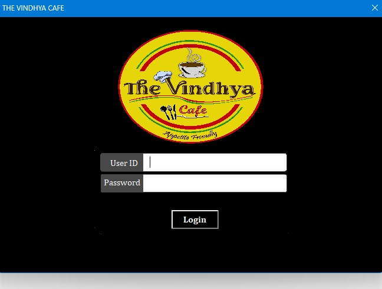
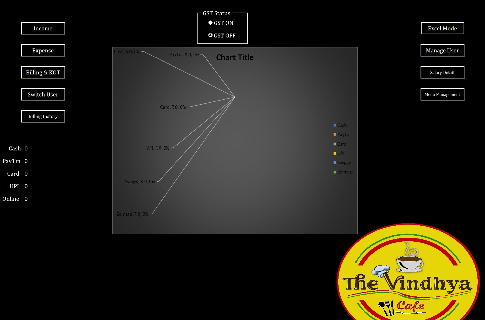
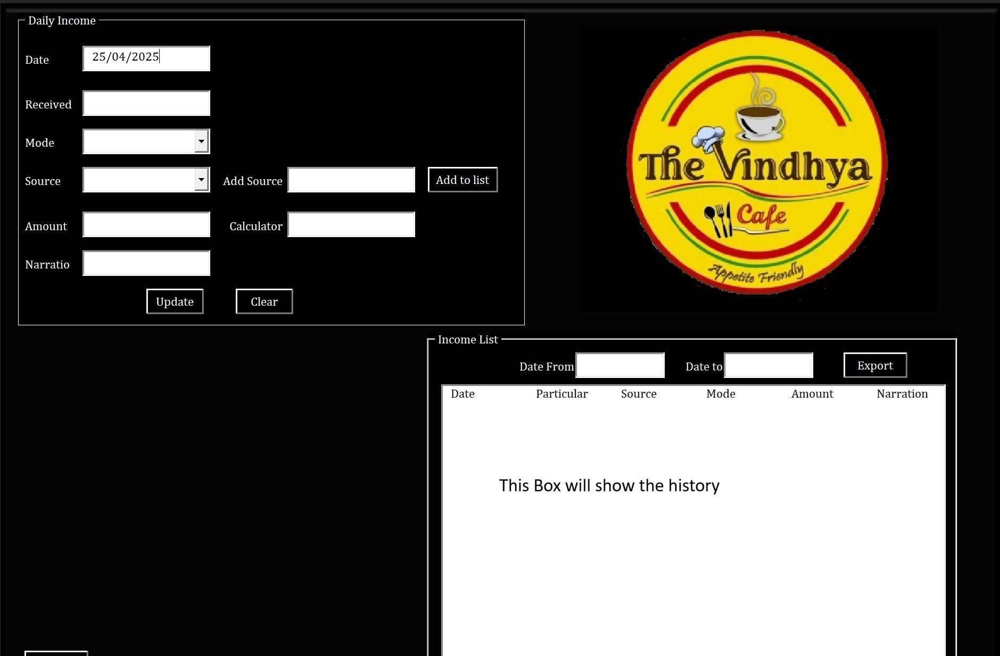
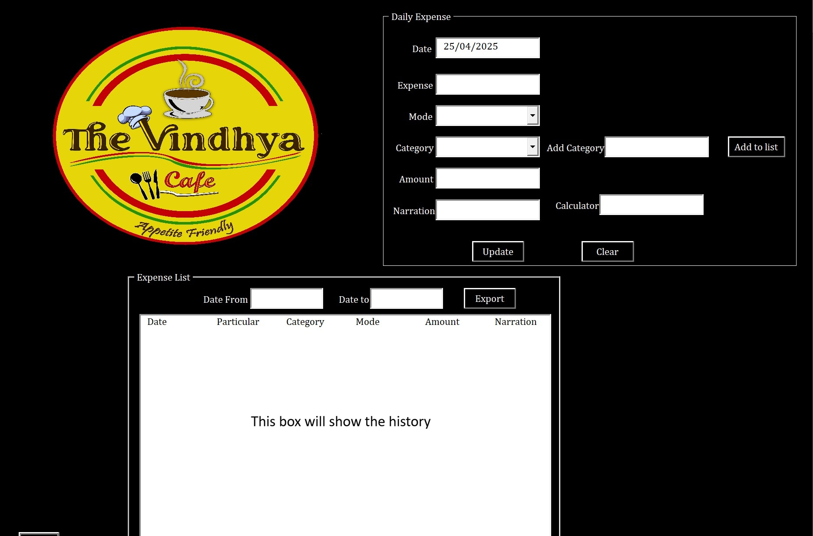
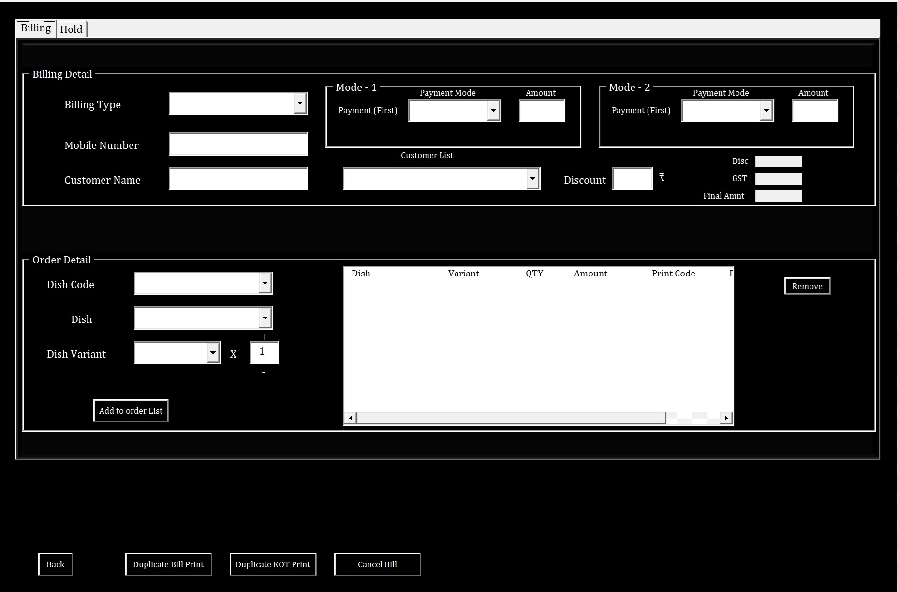

# Restaurant Billing System (Excel VBA + Access)

_A complete billing and restaurant operations system built using Excel VBA and Microsoft Access._

##  Overview

This project is a fully functional restaurant billing and operations system built using:
- **Excel VBA** as the front‑end application
- **Three Access databases** as the backend
- **ADODB** for database connectivity
- **`UserForms`** for the UI
- **Role‑based access control**
- **Automated workflows** for billing, customer management, income/expense tracking, and reporting

This system was originally created and used in a real restaurant environment. The version in this repository contains **sample data only** and is safe for public testing.

## Application Startup Behavior

When the workbook opens, the system launches in **App Mode**:
- Excel window hides automatically
- Login form appears immediately
- User interacts only with the application UI
- Excel grid is never shown
- Closing the app triggers a controlled shutdown

### Workbook logic:


```vb
Private Sub Workbook_Open()
    ThisWorkbook.Application.Visible = False
    Frm_LogIn.Show
End Sub
```

This behavior is intentional and part of the original design.
## Key Features

### Role‑Based Access Control (3 User Types)

#### Admin (demo1 / demo123)
- Full access
- Add/delete users
- Add salary, bonus, deductions
- View all reports
- Delete bills
- Access all settings

#### Moderate (demo3 / demo123)
- View old bills (history)
- View reports
- Search customers
- Cannot modify users or salaries

#### Restricted (demo2 / demo123)
- Billing only
- Generate bills
- Add new customers
- Search returning customers
- Cannot view history or reports

### Multi‑Database Architecture (3 Access Databases)
The system uses **three separate Access databases**, each with a dedicated purpose:
#### Users & Master Data (`users.accdb`)
- Usernames & passwords
- Role permissions
- Customer details
- Menu items
- Validation tables

#### Finance & Ledger Database (`finance.accdb`)
- Daily income
- Expenses
- Ledger entries
- Cheque details
- Staff salary, bonus, deductions

#### Billing Database (`billing.accdb`)
- Billing records
- Dining “hold bills”
- Settled bills
- Historical billing data

This separation improves performance, security, and maintainability.

## Architecture Diagram


```shell
+-------------------------+           +-------------------------+
|     Excel Front-End     | -------→  |   Access DB: Users      |
|  (VBA UserForms + UI)   |  ADODB    | (Auth + Customers + Menu)|
+-----------+-------------+           +-------------------------+
            |               \
            | ADODB          \ ADODB
            ↓                  ↘
+-------------------------+     +-------------------------+
| Access DB: Finance      |     | Access DB: Billing      |
| (Income + Expense +     |     | (Bills + Hold Bills +   |
|  Salary + Ledger)       |     |  History)               |
+-------------------------+     +-------------------------+
```

## Major Modules

### Authentication
- Login form
- Role validation
- Permission‑based UI
- User switching

### Billing System
- Menu selection
- Auto‑calculated totals
- Save bill to database
- Dining “hold bill” support

### Customer Management
- Add new customers
- Search returning customers
- Auto‑fill customer details

### Income & Expense Tracking
- Daily income updates
- Expense entry
- Category‑based reporting

### Salary & Staff Management
- Salary setup
- Bonus & deductions
- Ledger integration


## Tech Stack

| Layer         | Technology                     |
| ------------- | ------------------------------ |
| Front-End     | Excel VBA (UserForms, Modules) |
| Backend       | Microsoft Access (3 databases) |
| Connectivity  | ADODB (OLEDB Provider)         |
| Reporting     | Excel dashboards & forms       |
| File Handling | Dynamic folder selection       |

## How to Run the Demo

### Download the Required Files

Download from this repository:

- Excel Application `/dist/RestaurantBilling_Demo.xlsm`
- Demo Databases `/database/users.accdb` `/database/finance.accdb` `/database/billing.accdb`

### Place All Files in the Same Folder

Create a folder and place:
- `.xlsm` file
- all `.accdb` files

The system relies on this structure.

### Open the Excel File
- Enable macros
- Application launches in App Mode
- Login form appears

### Demo Login Credentials

| Role       | Username | Password |
| ---------- | -------- | -------- |
| Admin      | demo1    | demo123  |
| Restricted | demo2    | demo123  |
| Moderate   | demo3    | demo123  |

### Access Database Password

All three Access databases use:


```text
demo123
```

### VBA Project Password

To view the source code:


```text
demo123
```

## Folder Structure


```text
/src/
   /modules/
   /forms/
   /classes/
   /workbook/ (ThisWorkbook.cls)

 /sample-data/
   users.accdb
   finance.accdb
   billing.accdb

 /docs/
   screenshots...

 README.md
```

## Security Notice

All data in this repository is **fictional** and used only for demonstration. All real business data, customer records, financial information, and original passwords have been removed.

## Screenshots
<table>
  <tr>
    <td>
      
    </td>
    <td>
      
    </td>
  </tr>
  <tr>
    <td>
      
    </td>
    <td>
      
    </td>
    <td>
      
    </td>
  </tr>
</table>

<br/>

```text
docs/
│── login.jpg
│── Billing_KOT.jpg
│── ExpensePage.jpg
│── IncomePage.jpg
│── MainPage.jgp
```